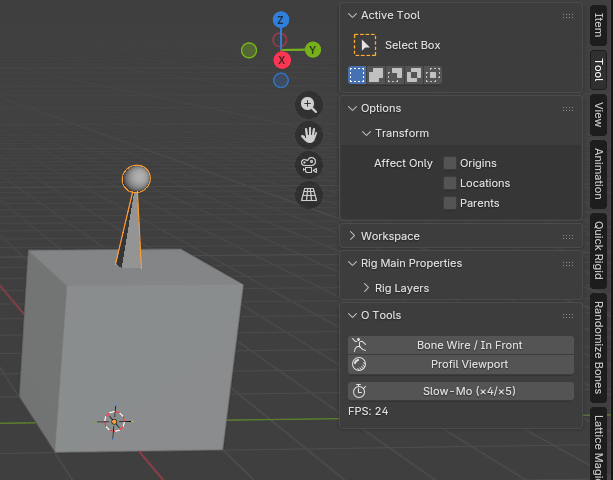
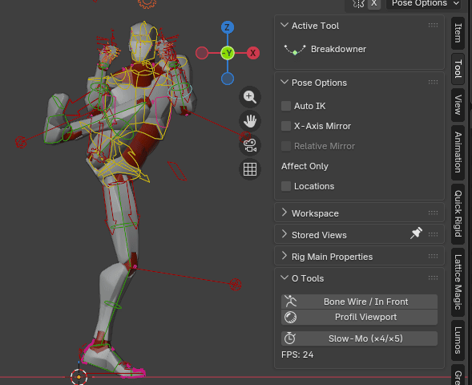
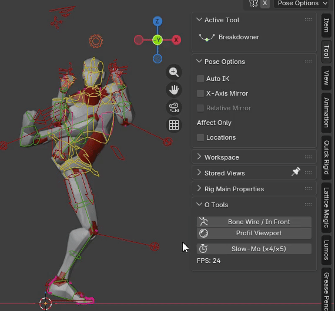

# O Tools

Addon personnel ultra-pratique pour rigging & animation sous Blender 4.2+.

### Fonctionnalités
- **Bone Wire / In Front** toggle

- **Smart Slow-Mo** : multiple intelligent du FPS original  
  → 24 → 6 fps 25 → 5 fps 30 → 6 fps 50 → 10 fps 60 → 12 fps etc.
- **Affichage FPS en temps réel** dans le panel (s’actualise même depuis la Timeline)

- **Profil Viewport** : silhouette noire propre, pour vérifier le profil d'un personnage par exemple.
  → Flat + fond noir + overlays/gizmos désactivés  
  → fonctionne depuis **n’importe quel mode** (Solid, Wireframe, Material Preview, Rendered)  
  → retour **exact** à l’état précédent (multi-viewport supporté)

### Installation
1. Aller dans l’onglet **Releases** → télécharger le .zip le plus récent  
   → https://github.com/olanlive/o_tools/releases
2. Blender → Edit → Preferences → Add-ons → Install → sélectionner le .zip → Enable

### Auteur
Olivier L with Grok  
Licence GPL-3.0

---

# O Tools

Ultra-useful personal add-on for rigging & animation in Blender 4.2+.

### Features
- **Bone Wire / In Front** toggle

- **Smart Slow-Mo** : clean integer multiple of original FPS  
  → 24 → 6 fps 25 → 5 fps 30 → 6 fps 50 → 10 fps 60 → 12 fps etc.
- **Live FPS display** in the panel (updates instantly from Timeline too)

- **Profil Viewport** : clean black silhouette, for example to check a character's profile.  
  → Flat shading + black background + overlays/gizmos hidden  
  → works from **any viewport mode** (Solid, Wireframe, Material Preview, Rendered)  
  → **exact** restoration of previous state (multi-viewport supported)

### Installation
1. Go to **Releases** tab → download the latest .zip  
   → https://github.com/olanlive/o_tools/releases
2. Blender → Edit → Preferences → Add-ons → Install → select the .zip → Enable

### Author
Olivier L with Grok  
License GPL-3.0
